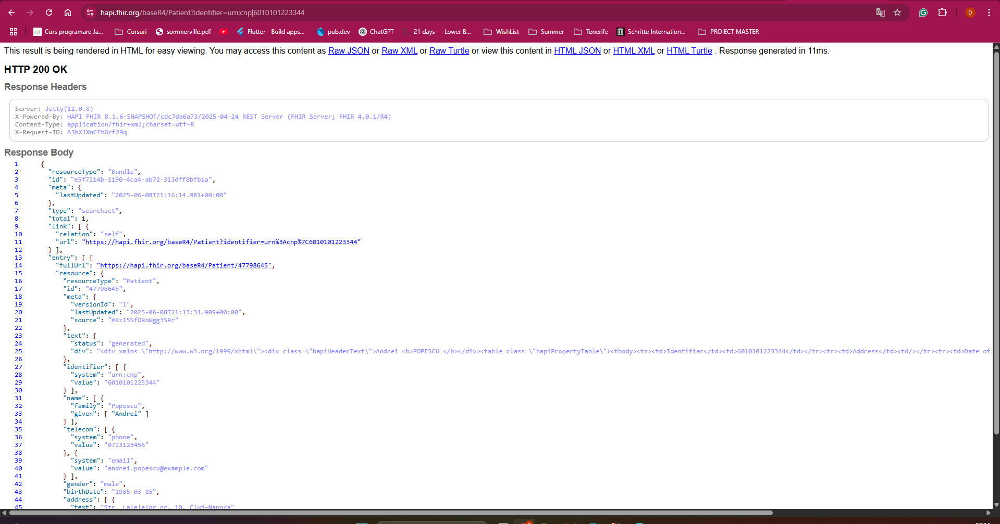

# H2GO

For Web App run this commands:

* npm init -y 
* npm install express cors mssql bcrypt jsonwebtoken dotenv
* npm install uuid
* npm install js-guid

To sun the backend server locally run:

* node server.js

To install de HL7 package:

* npm install fhir-kit-client

In raspunsul HL7 cautam dupa cnp-ul pacientului: https://hapi.fhir.org/baseR4/Patient?identifier=urn:cnp|6010101223344 

